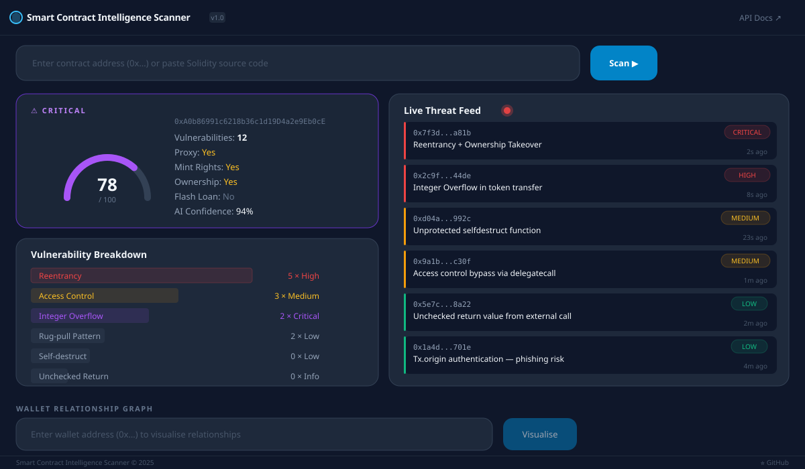
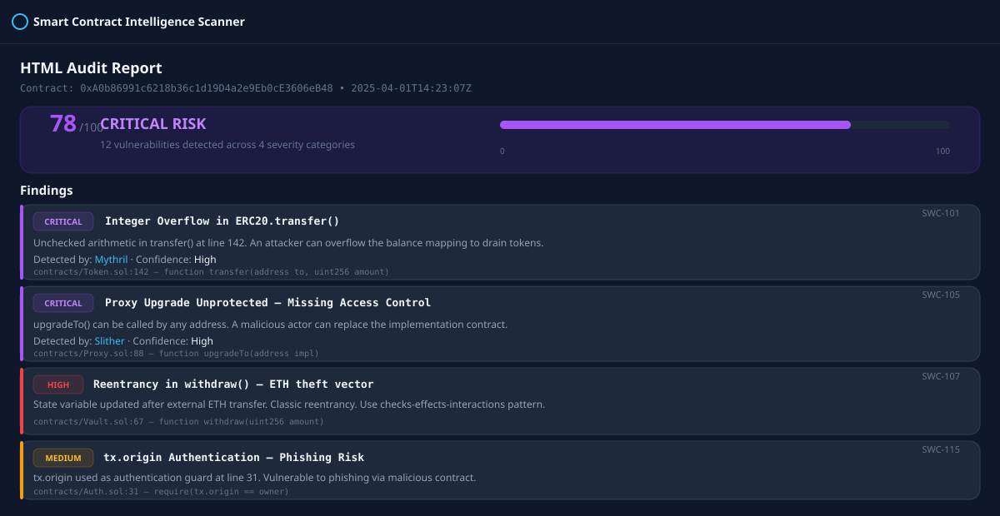
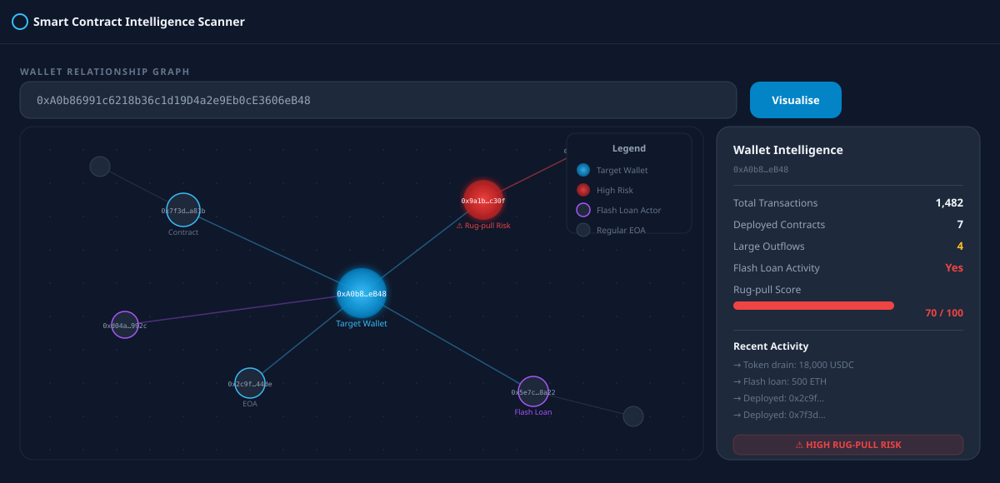
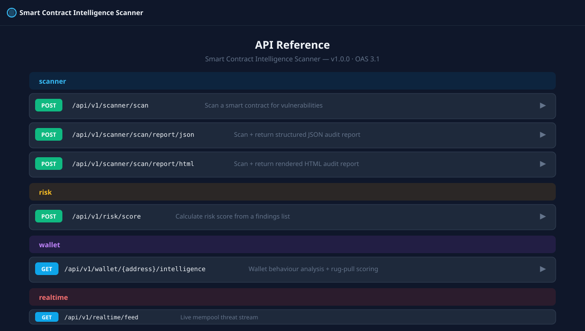

<div align="center">

# 🛡️ Smart Contract Intelligence Scanner

**A production-grade Web3 security platform that audits Solidity contracts, profiles on-chain behaviour, and assigns dynamic risk scores — in seconds.**

[](https://www.python.org/)
[](https://fastapi.tiangolo.com/)
[](https://nextjs.org/)
[](https://www.postgresql.org/)
[](docker/docker-compose.yml)
[](LICENSE)

</div>

---

## 📸 Screenshots

### Dashboard — Overview


### Scan Report — Findings Detail


### Wallet Relationship Graph


### Interactive API Docs (Swagger UI)


---

## ✨ Key Features

| Feature | Details |
|---------|---------|
| 🔬 **Static Analysis** | 50+ [Slither](https://github.com/crytic/slither) detectors + [Mythril](https://github.com/ConsenSys/mythril) symbolic execution |
| 🤖 **AI Classification** | Random Forest classifier auto-bootstraps on first run, no pre-trained weights needed |
| 📊 **Risk Scoring** | Normalised 0–100 score with severity weighting, contract profile flags, and AI confidence boost |
| 🏗️ **Contract Profiling** | Proxy / upgradeability · Minting rights · Ownership · Flash loan capability · Self-destruct |
| 👛 **Wallet Intelligence** | On-chain behaviour analysis, large outflow detection, flash loan activity, rug-pull scoring |
| 🌐 **Live Threat Feed** | Real-time mempool listener auto-scans newly deployed contracts |
| 📄 **Audit Reports** | Export full audit as structured JSON or rendered HTML |
| 🖥️ **Next.js Dashboard** | Dark-mode React UI with D3 wallet graph, Chart.js breakdowns, and live feed |

---

## 🏗️ Architecture

```
Smart-Contract-Intelligence-Scanner/
├── app/                          # FastAPI backend
│   ├── api/v1/
│   │   ├── scanner.py            # POST /scan, /scan/report/json, /scan/report/html
│   │   ├── risk.py               # POST /risk/score
│   │   ├── wallet.py             # GET  /wallet/{address}/intelligence
│   │   ├── realtime.py           # GET  /realtime/feed  (mempool stream)
│   │   └── graph.py              # GET  /graph/{address}
│   ├── core/
│   │   ├── scanner/              # Slither + Mythril wrappers
│   │   ├── analyzer/             # Vulnerability parser, risk engine, contract profiler
│   │   ├── intelligence/         # Blockchain client, wallet analyzer, rug-pull detector
│   │   └── ai/                   # ML classifier + feature extractor
│   ├── models/                   # SQLAlchemy ORM models (async)
│   ├── schemas/                  # Pydantic v2 request / response models
│   ├── services/                 # Orchestration: scan, wallet, report
│   └── utils/                    # structlog, helpers
├── dashboard/                    # Next.js 15 frontend
│   └── src/components/
│       ├── ContractSearch.tsx
│       ├── RiskScoreCard.tsx
│       ├── VulnerabilityBreakdown.tsx
│       ├── LiveThreatFeed.tsx
│       └── WalletGraph.tsx       # D3-powered interactive graph
├── tests/                        # pytest async test suite
└── docker/                       # Dockerfile + docker-compose.yml
```

---

## 🚀 Quick Start

### Prerequisites

| Requirement | Version | Install |
|-------------|---------|---------|
| Python | 3.11+ | [python.org](https://python.org) |
| PostgreSQL | 14+ | [postgresql.org](https://postgresql.org) |
| Redis | 7+ | [redis.io](https://redis.io) |
| Node.js | 20+ | [nodejs.org](https://nodejs.org) |
| solc | 0.8.x | `solc-select install 0.8.19` |

### Option A — Docker (recommended, one command)

```bash
git clone https://github.com/dnlkilonzi-pixel/Smart-Contract-Intelligence-Scanner.git
cd Smart-Contract-Intelligence-Scanner
cp .env.example .env          # fill in your API keys
docker-compose -f docker/docker-compose.yml up --build
```

| Service | URL |
|---------|-----|
| REST API | http://localhost:8000 |
| Swagger UI | http://localhost:8000/docs |
| Next.js Dashboard | http://localhost:3000 |

### Option B — Local Setup

```bash
# 1. Clone & install Python dependencies
git clone https://github.com/dnlkilonzi-pixel/Smart-Contract-Intelligence-Scanner.git
cd Smart-Contract-Intelligence-Scanner
pip install -r requirements.txt

# 2. Install static analysis tools
pip install slither-analyzer mythril
pip install solc-select && solc-select install 0.8.19 && solc-select use 0.8.19

# 3. Configure environment
cp .env.example .env
# Edit .env — set DATABASE_URL, ETHERSCAN_API_KEY, ETH_RPC_URL

# 4. Start database + cache
docker-compose -f docker/docker-compose.yml up db redis -d

# 5. Run the API server
uvicorn app.main:app --reload --host 0.0.0.0 --port 8000

# 6. (Optional) Run the dashboard
cd dashboard
npm install
npm run dev          # http://localhost:3000
```

---

## 📡 API Reference

### Contract Scanning

| Method | Endpoint | Description |
|--------|----------|-------------|
| `POST` | `/api/v1/scanner/scan` | Scan a contract (source or address) |
| `POST` | `/api/v1/scanner/scan/report/json` | Scan + structured JSON audit report |
| `POST` | `/api/v1/scanner/scan/report/html` | Scan + rendered HTML audit report |

**Scan by source code:**
```bash
curl -X POST http://localhost:8000/api/v1/scanner/scan \
  -H "Content-Type: application/json" \
  -d '{
    "source_code": "pragma solidity ^0.8.0;\ncontract Vault {\n  mapping(address=>uint) bal;\n  function withdraw() external {\n    (bool ok,) = msg.sender.call{value: bal[msg.sender]}(\"\");\n    require(ok);\n    bal[msg.sender] = 0;\n  }\n}",
    "compiler_version": "0.8.19",
    "enable_mythril": false
  }'
```

**Scan by deployed address** (requires verified source on Etherscan):
```bash
curl -X POST http://localhost:8000/api/v1/scanner/scan \
  -H "Content-Type: application/json" \
  -d '{"address": "0xA0b86991c6218b36c1d19D4a2e9Eb0cE3606eB48"}'
```

**Example response:**
```json
{
  "address": "0xA0b86991c6218b36c1d19D4a2e9Eb0cE3606eB48",
  "risk_score": 78,
  "risk_level": "critical",
  "vulnerability_count": 12,
  "vulnerabilities": [
    {
      "name": "reentrancy-eth",
      "severity": "High",
      "description": "withdraw() sends ETH before updating state",
      "source_location": "Vault.sol:67"
    }
  ],
  "profile": {
    "is_proxy": true,
    "has_mint": true,
    "has_ownership": true,
    "has_flash_loan": false,
    "has_self_destruct": false,
    "creator_address": "0x1234…"
  },
  "ai_classification": "Reentrancy",
  "ai_confidence": 0.94
}
```

---

### Risk Scoring

| Method | Endpoint | Description |
|--------|----------|-------------|
| `POST` | `/api/v1/risk/score` | Calculate score from a findings list |

```bash
curl -X POST http://localhost:8000/api/v1/risk/score \
  -H "Content-Type: application/json" \
  -d '{"findings": [{"severity": "High"}, {"severity": "Medium"}, {"severity": "Low"}]}'
```

---

### Wallet Intelligence

| Method | Endpoint | Description |
|--------|----------|-------------|
| `GET` | `/api/v1/wallet/{address}/intelligence` | Behaviour analysis + rug-pull score |

```bash
curl http://localhost:8000/api/v1/wallet/0xA0b86991c6218b36c1d19D4a2e9Eb0cE3606eB48/intelligence
```

---

## 🔍 Vulnerability Coverage

| Category | Detectors | SWC IDs |
|----------|-----------|---------|
| Reentrancy (ETH + token) | Slither + Mythril | SWC-107 |
| Integer Overflow / Underflow | Mythril | SWC-101 |
| Access Control | Slither | SWC-105, SWC-106 |
| Unprotected Self-destruct | Slither | SWC-106 |
| Flash Loan Patterns | Custom heuristic | — |
| Rug-pull (arb. transfer) | Custom heuristic | — |
| tx.origin Authentication | Slither | SWC-115 |
| Unchecked Return Values | Slither | SWC-104 |
| Timestamp Dependence | Slither | SWC-116 |
| Uninitialized Storage | Slither | SWC-109 |

---

## 📊 Risk Score Reference

| Score | Level | Colour |
|-------|-------|--------|
| 0 – 14 | 🟢 Low | `#10b981` |
| 15 – 39 | 🟡 Medium | `#f59e0b` |
| 40 – 69 | 🔴 High | `#ef4444` |
| 70 – 100 | 🟣 Critical | `#a855f7` |

Score is computed as:
```
score = severity_weighted_sum × diminishing_returns × profile_multiplier × ai_boost
```

---

## 🧪 Running Tests

```bash
pip install pytest pytest-asyncio pytest-cov
python -m pytest tests/ -v --cov=app
```

---

## 🔧 Configuration

Copy `.env.example` to `.env` and fill in your values:

| Variable | Required | Description |
|----------|----------|-------------|
| `DATABASE_URL` | ✅ | PostgreSQL async DSN (`postgresql+asyncpg://…`) |
| `ETH_RPC_URL` | ✅ | Ethereum JSON-RPC (Infura / Alchemy) |
| `ETHERSCAN_API_KEY` | ✅ | For fetching verified source + wallet history |
| `REDIS_URL` | ✅ | Redis connection URL |
| `ETH_WS_URL` | ☑️ | WebSocket RPC for mempool listener |
| `MEMPOOL_AUTO_SCAN` | ☑️ | `true` to enable live mempool scanning |
| `SLITHER_TIMEOUT` | ☑️ | Max seconds for Slither (default `120`) |
| `MYTHRIL_TIMEOUT` | ☑️ | Max seconds for Mythril (default `300`) |
| `AI_MODEL_PATH` | ☑️ | Path to sklearn joblib model (auto-created) |
| `SECRET_KEY` | ✅ | Change in production |

---

## 🗺️ Roadmap

- [ ] Celery async task queue for long-running scans
- [ ] WebSocket scan progress streaming
- [ ] Multi-chain support (BSC, Polygon, Arbitrum)
- [ ] Graph-based rug-pull network analysis
- [ ] Fine-tuned LLM vulnerability explanation layer
- [ ] CI/CD pipeline with audit gate

---

## 🤝 Contributing

1. Fork the repository
2. Create a feature branch: `git checkout -b feature/my-feature`
3. Commit your changes: `git commit -m 'feat: add my feature'`
4. Push and open a Pull Request

---

<div align="center">
  Made with ❤️ for the Web3 security community
</div>
